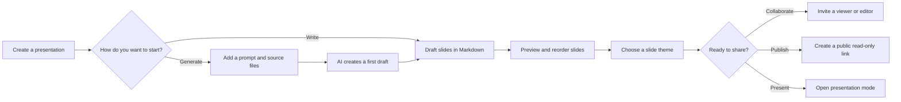
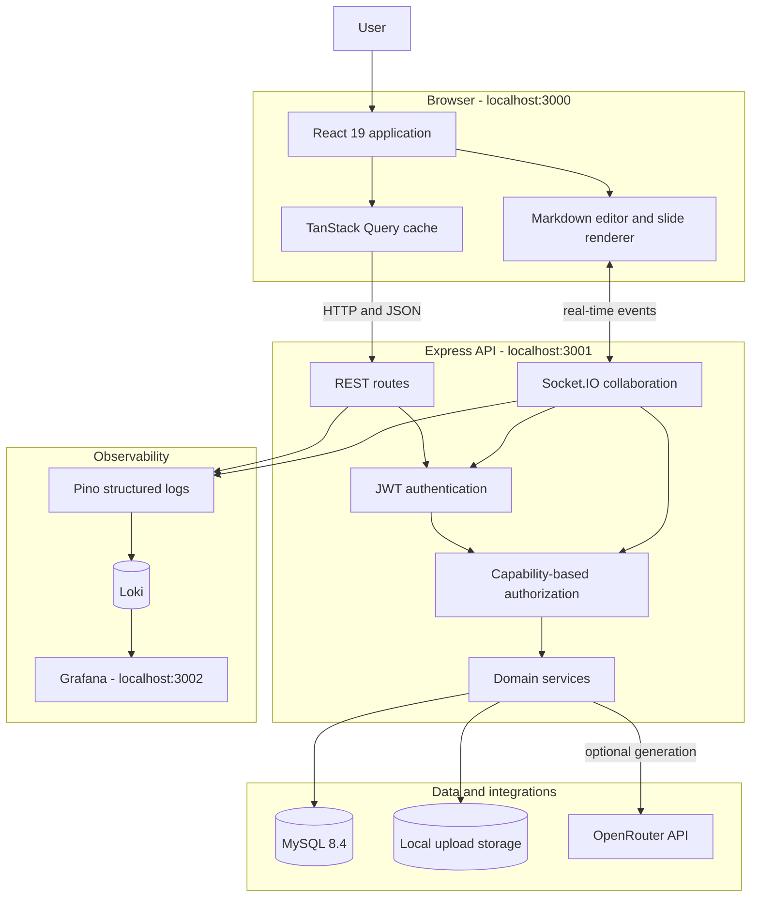
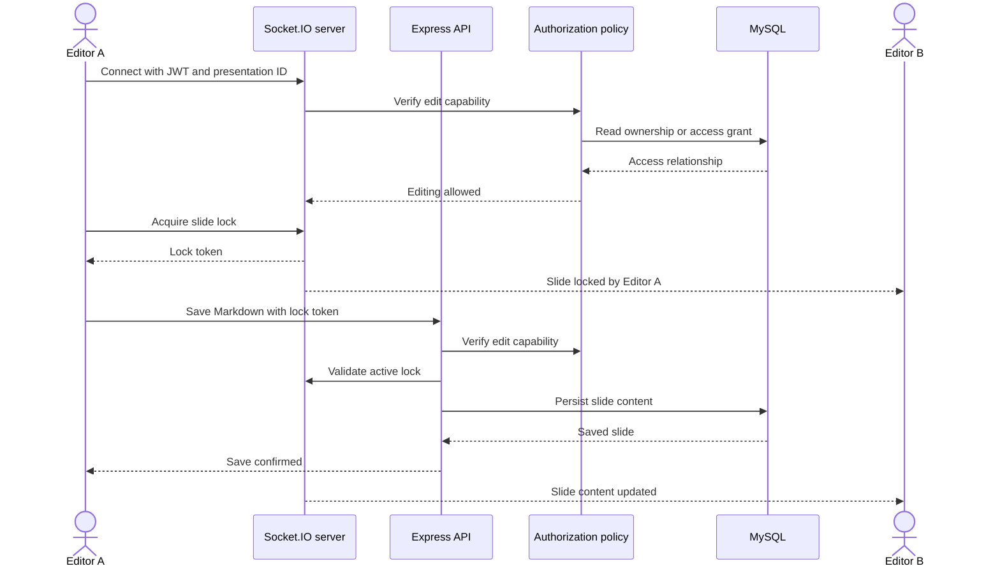
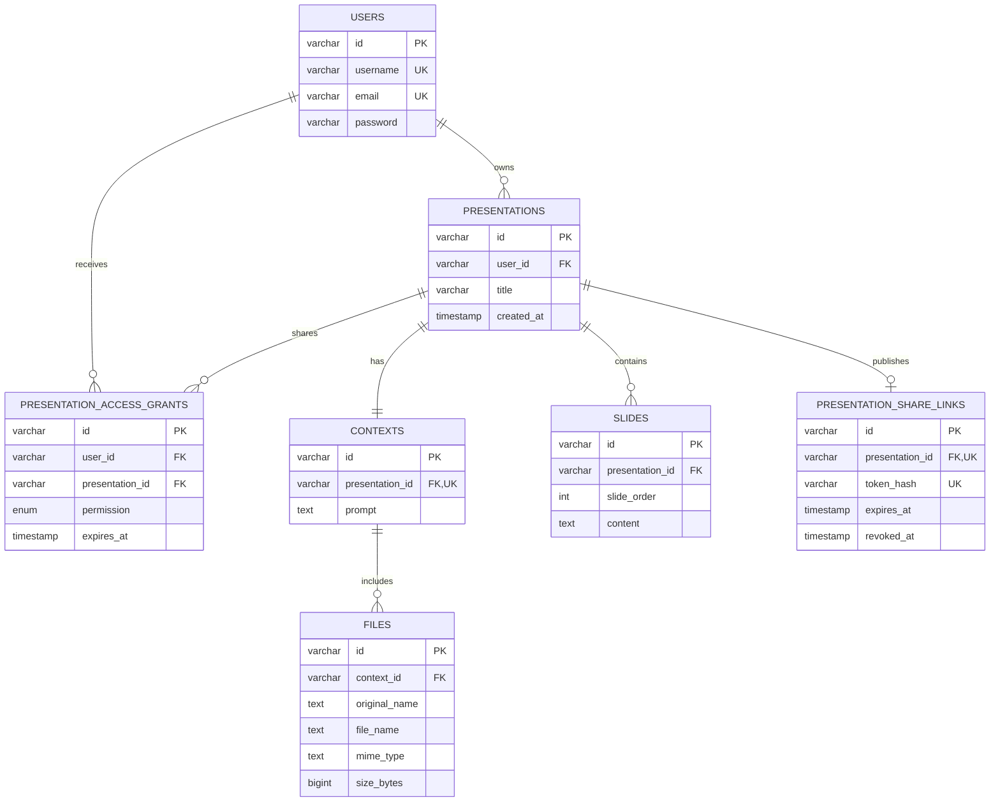

# MarkDeck (P2M)

> A Markdown-first presentation workspace for turning ideas, notes, and source files into polished, shareable slide decks.

MarkDeck helps students, educators, and other content-focused presenters move from a rough outline to a finished presentation without spending time positioning text boxes or learning a visual design tool. Users write in Markdown, see the result immediately, choose a slide theme, and present from the same workspace.

AI generation is available as an accelerator, not a requirement: a user can provide a prompt and supporting files, generate a first draft through OpenRouter, and then refine every slide in the Markdown editor.

## Product at a glance

### The problem

Traditional presentation tools make simple content changes expensive. Writing, layout, and visual styling compete for attention, while collaboration can introduce conflicting edits and unclear access rules.

### The solution

MarkDeck separates content from presentation styling:

- **Write naturally:** create and edit slides using familiar Markdown.
- **Preview instantly:** work in a split editor with a live rendered slide canvas.
- **Start faster with AI:** combine a prompt and reference files to generate a structured first draft.
- **Keep the deck consistent:** apply one of 26 themes to slides without changing the application interface.
- **Collaborate deliberately:** invite viewers or editors, set expiration dates, and prevent simultaneous edits to the same slide.
- **Share beyond the workspace:** create revocable public links for read-only viewing.
- **Present with focus:** use a dedicated, keyboard-friendly playback experience.



## Engineering highlights

- **End-to-end TypeScript monorepo:** React 19 and Express 5 are managed through npm workspaces with a single dependency lockfile.
- **Explicit authorization model:** presentation owners, editors, viewers, and anonymous link visitors receive capability-based access rather than scattered role checks.
- **Conflict-aware collaboration:** Socket.IO rooms broadcast deck changes while short-lived, server-enforced slide locks prevent two editors from overwriting one another.
- **Transactional persistence:** Drizzle ORM models presentation content and access relationships in MySQL, with service methods accepting a database or transaction context.
- **Secure sharing:** public tokens are random, stored only as SHA-256 hashes, and can be expired, rotated, or revoked.
- **Observable backend:** structured Pino request logs include correlation IDs, redact credentials, and can stream to Loki for exploration in Grafana.
- **Graceful operations:** the API handles shutdown signals, drains active work, closes real-time connections, and flushes log destinations.

## Architecture

MarkDeck uses a two-application monorepo. The browser owns the interactive editing and playback experience. The Express API owns authentication, authorization, presentation rules, file handling, AI orchestration, and real-time coordination. MySQL is the system of record.



### Collaborative editing flow

Editing rights are checked twice: when the real-time connection opens and when a write reaches the HTTP API. A lock token proves that the caller currently owns the slide lock.



### Data model

Presentation content, source context, collaboration grants, and public links are represented explicitly. Cascading foreign keys keep dependent data consistent when a presentation is deleted.



## Technology stack

| Area | Technology | Responsibility |
| --- | --- | --- |
| Frontend | React 19, TypeScript, Vite | Application shell, editor, viewer, and routing |
| UI | Tailwind CSS 4, Radix UI, Lucide | Accessible components, responsive layout, and icons |
| Client data | TanStack Query | API state, caching, invalidation, and mutation feedback |
| Content | React Markdown, Remark GFM | Markdown parsing and slide rendering |
| Backend | Express 5, Node.js ESM | REST API, validation, orchestration, and error handling |
| Real time | Socket.IO | Presentation rooms, slide locks, and change notifications |
| Database | MySQL 8.4, Drizzle ORM | Relational persistence, schema, and migrations |
| Authentication | JWT, HTTP-only refresh cookie | Short-lived access sessions and token refresh |
| AI | OpenRouter | Optional Markdown slide generation from prompts and files |
| Observability | Pino, Loki, Grafana | Structured logs, redaction, correlation, and dashboards |
| Infrastructure | Docker Compose | Local API, database, and observability services |

## Repository structure

```text
p2m/
├── backend/
│   ├── api/                 # Entity routers and domain services
│   ├── authorization/       # Central presentation access policy
│   ├── config/              # Environment, logging, and upload configuration
│   ├── database/            # Drizzle schema, migrations, and seed data
│   ├── middleware/          # Authentication and global error handling
│   ├── realtime/            # Socket.IO rooms and slide-lock coordination
│   ├── routes/              # Authentication routes
│   └── app.ts               # Server entry point
├── frontend/
│   └── src/
│       ├── components/      # Shared UI and feature components
│       ├── context/         # Authentication and slide-theme state
│       ├── hooks/           # API client and TanStack Query hooks
│       ├── pages/           # Route-level screens
│       └── themes/          # Slide-only visual themes
├── observability/           # Loki and Grafana provisioning
├── docs/                    # Product and interface specifications
└── docker-compose.yaml      # Local service topology
```

## Local setup

### Prerequisites

- Node.js 24 or a compatible current Node.js release
- npm
- Docker Engine with Docker Compose
- An OpenRouter API key only if AI slide generation is needed

### 1. Install dependencies

Run this once from the repository root. npm installs both workspaces from the shared lockfile.

```bash
npm install
```

### 2. Configure the environment

Create `.env` in the repository root. The values below are suitable for local Docker development; replace both JWT secrets with independently generated values.

```dotenv
# MySQL
DB_HOST=mysql
DB_PORT=3306
MYSQL_ROOT_PASSWORD=local-root-password
MYSQL_DATABASE=p2m
MYSQL_USER=p2m
MYSQL_PASSWORD=local-app-password

# API inside its container (published as localhost:3001)
PORT=3000
ALLOWED_ORIGINS=http://localhost:3000
JWT_ACCESS_TOKEN_SECRET_KEY=replace-with-a-long-random-secret
JWT_REFRESH_TOKEN_SECRET_KEY=replace-with-a-different-long-random-secret

# Public URLs
FRONTEND_URL=http://localhost:3000

# Observability
LOKI_URL=http://loki:3100/loki/api/v1/push

# Optional AI generation
# OPENROUTER_API_KEY=your-key
# OPENROUTER_MODEL=tencent/hy3:free
# OPENROUTER_MAX_FILE_BASE64_CHARS=50000
```

Generate strong local secrets with:

```bash
openssl rand -base64 48
```

Run the command twice and use a different result for each JWT secret.

### 3. Start the backend services

```bash
npm run docker:up
```

This starts MySQL, the Express API, Loki, and Grafana. The first run may take a few minutes while Docker downloads images and builds the backend.

### 4. Apply the database schema

```bash
docker compose exec backend npm run db:migrate --workspace=backend
```

Optional: populate the database with development presentations and users. The seed command prints the generated demo credentials.

```bash
docker compose exec backend npm run seed --workspace=backend
```

### 5. Start the frontend

In a second terminal:

```bash
npm run dev:client
```

Open the services at:

| Service | URL |
| --- | --- |
| MarkDeck | http://localhost:3000 |
| API health check | http://localhost:3001/health |
| Grafana | http://localhost:3002 |
| Loki | http://localhost:3100 |

Grafana's local credentials are `admin` / `admin`.

### Useful commands

```bash
# Frontend quality checks
npm run build --workspace=frontend
npm run lint --workspace=frontend

# Backend build and database utilities
npm run build --workspace=backend
npm run test:db --workspace=backend
npm run db:generate --workspace=backend

# Local service management
npm run docker:logs
npm run docker:down
npm run docker:rebuild
```

## API shape

The frontend communicates through Vite's `/api` and `/socket.io` proxies during development. Authentication routes and public share-link reads are public; every other API route requires a bearer access token.

| Capability | Main endpoints |
| --- | --- |
| Authentication | `POST /api/auth/register`, `POST /api/auth/login`, `POST /api/auth/refresh` |
| Presentations | `GET /api/presentations`, `POST /api/presentation`, `PUT /api/presentation/:id`, `DELETE /api/presentation/:id` |
| Slides | `GET/POST /api/presentations/:id/slides`, update, delete, reorder, and generate routes |
| Context | `GET/PUT /api/contexts/:id` with multipart file uploads on updates |
| Collaboration | access-grant and share-link routes under `/api/presentations/:id` |
| Public viewing | `GET /api/public/share/presentation` with an `X-Share-Token` header |

## Design decisions

**Markdown remains the source of truth.** The application renders structured text instead of storing coordinates for visual elements. This keeps content portable and makes editing predictable.

**Themes are isolated to the slide canvas.** A deck can change visual identity without recoloring the dashboard or editor controls, so the workspace remains consistent and accessible.

**Authorization is a domain policy.** Routes ask whether a user can perform a capability such as view, edit content, share, or delete. Ownership, grants, expiration, and public links are evaluated centrally.

**Collaboration favors correctness over silent merging.** Slide-level locks allow people to work on different slides concurrently while preventing last-write-wins data loss on the same slide.

**AI output is editable content.** Generated slides use the same Markdown model as manually authored slides; users are never locked into a separate generated format.

## Current scope

MarkDeck currently supports the complete create, edit, theme, view, collaborate, and public-share workflow. File-backed AI generation requires an OpenRouter key, and uploaded files use local disk storage in the current deployment model. A production deployment would typically replace local uploads with object storage and provide managed MySQL and observability services.

---

Built as a product and engineering portfolio project: a focused user experience backed by explicit domain rules, real-time coordination, relational persistence, and operational visibility.
